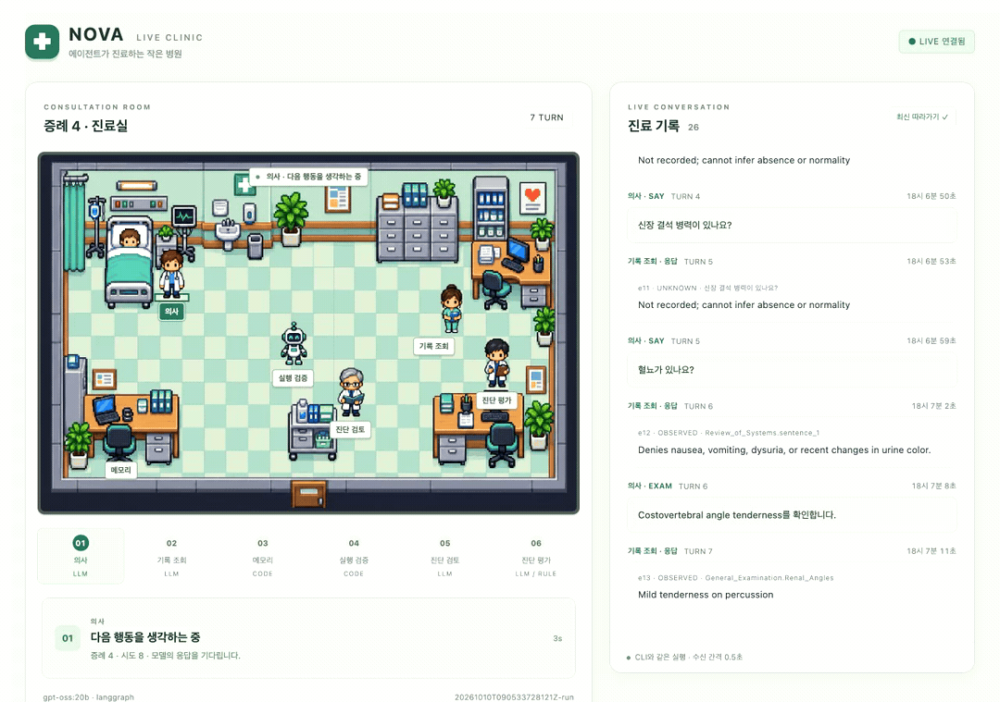

# Medical AI Agent · NOVA Live Clinic

A local medical diagnostic agent built with **LangGraph**, **Ollama / gpt-oss:20b**, and public **AgentClinic MedQA_Ext** cases. A pixel hospital displays the actual CLI workflow: questions, recorded responses, memory updates, diagnosis review, and post-encounter evaluation.



*A 27-second excerpt from case 4 of a live CLI model run, played at 3× speed (9 seconds). The interface currently uses Korean labels. This is a workflow demonstration, not an accuracy result.*

## Quick start

Use Python 3.10+ in a virtual environment or an existing Conda environment. Install and start [Ollama](https://ollama.com/) separately.

```bash
python -m pip install -r requirements-langgraph.txt
ollama pull gpt-oss:20b

# Public practice data is downloaded separately; vendor/ is not committed.
# Skip cloning if vendor/AgentClinic already exists.
git clone https://github.com/SamuelSchmidgall/AgentClinic.git vendor/AgentClinic
git -C vendor/AgentClinic checkout b6fbe22300e99a267a7ac94eaa465ab552eef741

python run.py check
python run.py run --engine langgraph \
  --start-index 3 --limit 1 --verbose \
  --working-memory --diagnosis-review --judge-mode llm
```

`run` starts the localhost monitor and opens a browser at **http://127.0.0.1:8767/**. Add `--no-browser` to disable automatic startup/opening; `python run.py serve` opens the monitor server separately. The page observes events without controlling or blocking inference; updates appear after actions and responses finish, rather than token by token.

- `--start-index`: zero-based case index; `--limit`: number of consecutive cases.
- Default `--round preliminary`: `SAY`, `EXAM`, and `DIAGNOSE`. `--round final` also enables `TEST` for local practice.
- `demo` runs a fixed script without a model; `run` performs real inference.

## How the agent works

The encounter repeats **choose an action → validate → retrieve recorded evidence → update state**, then submits a diagnosis and SOAP note. Each case has independent state.

| Role | Implementation |
| --- | --- |
| Doctor | LLM chooses questions, examinations, and the final diagnosis. |
| Record resolver | LLM selects relevant source IDs; Python returns the original AgentClinic text. |
| Working memory | Python stores acquired facts and unavailable requests; the doctor proposes evidence-linked hypotheses and the next information target. |
| Execution guard | Python validates actions, evidence IDs, repeated questions, and local budgets. |
| Diagnosis reviewer | Optional LLM comparison of up to three existing candidates with quoted evidence. |
| Diagnosis evaluator | Post-encounter exact/alias rules, plus an optional LLM diagnosis-identity assessment. |

The doctor does not receive gold labels or unacquired findings. Missing records return **`UNKNOWN`**, which must not be interpreted as a normal or negative finding. Characters represent workflow roles; they are not six independently trained models.

## Evaluation and optimization

`--judge-mode llm` enables semantic diagnosis assessment using the configured model. The default `aliases` mode handles normalized exact matches and reviewed PML aliases; other labels remain unresolved. **A completed encounter or accepted review does not mean the diagnosis is correct.**

Each run writes its location after `Artifacts:`:

- `results.jsonl`: final `diagnosis`, `gold_diagnosis`, `diagnosis_assessment`, actions, evidence, memory, and review logs.
- `events.jsonl`: the live monitor's event stream.
- `case-N-soap.json`, `manifest.json`, `cases.csv`, `summary.json`: SOAP notes, configuration/provenance, and aggregate metrics.

```bash
# Paired evaluation of matching cases and settings:
python eval.py compare outputs/BASELINE outputs/CANDIDATE --output outputs/COMPARISON

# Generate and compare workflow instructions on fixed development cases:
python optimize.py --split-file eval/split.json --limit 2 --candidates 1
```

Prompt optimization analyzes failures, generates candidate instructions, and re-evaluates them on development cases. **It does not update model weights.** Freeze the selected instructions before evaluating separate test cases; development improvements alone do not establish generalization.

This is an educational research prototype, not a clinical service or the official AgentClinic/NOVA evaluation SDK. Record matching and model judgments can be wrong; no clinical validation or official benchmark score is claimed. Public-data provenance is recorded, but model pretraining overlap is unknown. Source data and its license are retained in the separately downloaded [AgentClinic repository](https://github.com/SamuelSchmidgall/AgentClinic).
